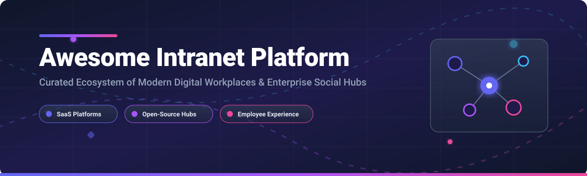

# Awesome Intranet Platform    

  

## 🏢 Top Intranet Platforms Ecosystem: Enterprise Digital Workplace & Employee Experience Hubs 🌐

**Curated List of SaaS Products & Open-Source GitHub Projects** 🚀  
*Focused on Employee Communication, Digital Workplace, Knowledge Sharing, Enterprise Search & Internal Collaboration* 💬  
**📅 Last updated: September 2026**

---

Welcome to the **Awesome Intranet Platform** directory! 🌟 This repository tracks top-tier **SaaS platforms** ☁️ and **open-source intranet software** 💻 designed to connect hybrid and deskless workforces, streamline internal communication, centralize knowledge management, and enhance employee engagement across enterprise organizations.

---

## 📑 Table of Contents
- [📊 Market Overview & Ecosystem Dynamics](#-market-overview--ecosystem-dynamics)
- [☁️ SaaS & Enterprise Hosted Platforms](#%EF%B8%8F-saas--enterprise-hosted-platforms)
- [💻 Open-Source GitHub Projects](#-open-source-github-projects)
- [🏗️ Architecture & Tech Stack Blueprint](#%EF%B8%8F-architecture--tech-stack-blueprint)
- [🤝 How to Contribute](#-how-to-contribute)
- [💖 Support & Sponsorship](#-support--sponsorship)
- [⚖️ Disclaimer & Compliance](#%EF%B8%8F-disclaimer--compliance)
- [📈 Star History](#-star-history)

---

## 📊 Market Overview & Ecosystem Dynamics

> [!NOTE]
> **Market Size & Valuation** 📈: The global intranet and digital workplace software market is estimated at **$4.8B – $5.2B in 2026** and projected to reach **$22B+ by 2034** with a CAGR of **~12.5%**.
> 
> **Competitive Dynamics** 🧩: The sector is **moderately to highly fragmented** rather than a "winner-take-all" landscape. Enterprise buyers increasingly deploy modular, composable digital workplaces combining specialized EX (Employee Experience) tools, enterprise wikis, and frontline communication hubs over monolithic single-vendor suites.

---

## ☁️ SaaS & Enterprise Hosted Platforms

The table below summarizes leading commercial SaaS intranet providers, ordered by company size (estimated revenue / valuation / parent organization scale, descending). 🏢

| Platform 🏢 | Starting Paid Tier Price 💰 | Free Tier / Free Trial Limit 🎁 | Enterprise Scale (Revenue / Valuation) 📊 | Key Features & Strengths ✨ |
| :--- | :--- | :--- | :--- | :--- |
| **[Workvivo](https://www.workvivo.com/)** | **$20,000 / year** (base enterprise package) | **14-day free trial** (custom sales setup) | **>$100M ARR** (Acquired by Zoom) | Social-style employee engagement, frontline mobile app, activity feeds, Zoom ecosystem integration. 📱 |
| **[Simpplr](https://www.simpplr.com/)** | **$4.00 / user / month** (contract starting tier) | **14-day free trial** (upon sales approval) | **$547M Valuation** ($131M raised) | AI-powered enterprise search, personalized activity feeds, integrations with SharePoint, Box, and Google Drive. 🤖 |
| **[LumApps](https://www.lumapps.com/)** | **$6.00 / user / month** (annual commitment) | **14-day free trial** (requested via sales) | **~$65M ARR** ($102M funding) | Google Workspace & Microsoft 365 alignment, brand portal customization, multi-lingual enterprise workflows. 🌍 |
| **[Unily](https://www.unily.com/)** | **$5.00 / user / month** (enterprise volume tier) | **14-day free trial** (demo-gated request) | **~$55M ARR** (Acquired by CVC Capital) | Targeted multi-channel internal communications campaigns, widget framework, high-security governance. 🛡️ |
| **[Interact Software](https://www.interactsoftware.com/)** | **$5.00 / user / month** (base package) | **14-day free trial** (upon request) | **~$36M ARR** (Private VC-backed) | Mature intranet platform, analytics engine, content management governance, high customer retention. 📊 |
| **[Haiilo](https://www.haiilo.com/)** | **$4.50 / user / month** (base volume plan) | **14-day free trial** (sales-arranged) | **~$30M ARR** (Private / Merged COYO+Smarp) | Employee advocacy module, pulse surveys, behavioral engagement analytics, social intranet feed. 📢 |
| **[Igloo Software](https://www.igloosoftware.com/)** | **$8.00 / user / month** (starter business tier) | **14-day free trial** (self-serve/sales setup) | **~$25M ARR** (Gartner Visionary) | Digital workplace hubs, departmental team spaces, knowledge bases, governance and compliance controls. 🧊 |
| **[Happeo](https://www.happeo.com/)** | **$4.00 / user / month** (starter plan) | **14-day free trial** (direct signup) | **~$20M ARR** ($26M Series B) | Native Google Workspace deep integration, real-time page editor, universal search, employee directory. ⚡ |
| **[ThoughtFarmer](https://www.thoughtfarmer.com/)** | **$5.00 / user / month** (volume tier) | **14-day free trial** (instant trial access) | **~$12M ARR** (Independent profitable) | Hybrid work collaboration, organizational chart visualizer, employee recognition, intuitive UI. 🌾 |
| **[Axero](https://www.axero.com/)** | **$10.00 / user / month** (starter tier) | **14-day free trial** (guided walkthrough) | **~$6.4M ARR** (Self-funded / Bootstrap) | Flexible wiki/blog architecture, built-in task management, customizable UI, IndexedDB web hub support. 🔧 |

---

## 💻 Open-Source GitHub Projects

Open-source intranet solutions offer complete code transparency, self-hosted data privacy, custom extensibility, and freedom from per-seat SaaS licensing fees. 🔓

The table below is sorted by **GitHub Stars_Count (Descending)**. 🌟

| Project 🛠️ | GitHub_Stars ⭐ | License 📜 | Primary Tech Stack ⚙️ | Description & Strategic Focus 🎯 |
| :--- | :--- | :--- | :--- | :--- |
| **[Plane](https://github.com/makeplane/plane)** |  | Apache-2.0 | Next.js, Python, Django, PostgreSQL | Open-source enterprise project management and workspace hub; ideal digital workplace component for tracking organizational goals and issue tracking. ✈️ |
| **[Outline](https://github.com/outline/outline)** |  | BSL 1.1 / AGPL-3.0 | React, Node.js, TypeScript, PostgreSQL | Modern, ultra-fast knowledge base and wiki for growing teams. Seamless Markdown editor and real-time collaborative document structure. 📝 |
| **[Mattermost](https://github.com/mattermost/mattermost)** |  | AGPL-3.0 | Go, React, PostgreSQL, MySQL | Open-source enterprise messaging, workplace chat, and incident response platform. Replaces proprietary internal communications tools. 💬 |
| **[Nextcloud Server](https://github.com/nextcloud/server)** |  | AGPL-3.0 | PHP, Vue.js, PostgreSQL/MySQL | Self-hosted productivity suite featuring Nextcloud Hub (Files, Groupware, Talk, Office). Serves as complete open digital workplace for 10M+ users. ☁️ |
| **[Documenso](https://github.com/documenso/documenso)** |  | AGPL-3.0 | Next.js, TypeScript, Prisma, PostgreSQL | Open-source document signing and workflow tool designed for enterprise digital workplace integration. ✍️ |
| **[Liferay DXP](https://github.com/liferay/liferay-portal)** |  | LGPL-2.1 | Java, OSGi, React, Elasticsearch | Enterprise-grade digital experience portal. Offers low-code page builders, structured asset management, enterprise search, and workflow automation. 🧱 |
| **[XWiki Platform](https://github.com/xwiki/xwiki-platform)** |  | LGPL-2.1 | Java, Velocity, Solr, Hibernate | Advanced enterprise wiki and application platform with 900+ extensions. Matches proprietary wiki software feature-for-feature with fine-grained RBAC. 📚 |
| **[Twake Workplace](https://github.com/linagora/twake-workplace)** |  | AGPL-3.0 | TypeScript, React, PHP, Matrix | Open-source digital workplace featuring Matrix-powered chat, file storage, calendar, task management, and collaborative document editing. 👥 |
| **[eXo Platform](https://github.com/exoplatform/platform)** |  | LGPL-3.0 | Java 21, Spring 6, Vue.js, Tomcat | Leading open-source intranet platform with 20+ years of active development. Features AI chatbot integration, social wall, unified search, and PWA mobile apps. 🚀 |
| **[Simoona Intranet](https://github.com/VismaLietuva/simoona)** |  | MIT | AngularJS, C#, ASP.NET, Docker | Social intranet platform by Visma featuring interactive activity walls, employee directory, gamified Kudos peer recognition system, and event calendars. 🏆 |
| **[BlueSpice MediaWiki](https://github.com/HalloWelt/BlueSpice)** |  | GPL-2.0 | PHP, MediaWiki, JavaScript | Enterprise MediaWiki distribution tailored for knowledge management, quality documentation, compliance manuals, and internal IT wikis. 📖 |
| **[Digital Workplace Hub](https://github.com/WRVish/digital-workplace-employee-hub)** |  | MIT | React, SPFx, Microsoft 365 | Open-source Microsoft 365 employee portal with SPFx web parts and React SPA. Features leave management, asset tracking, expense claims, and ticketing. 🏢 |
| **[Axero Intranet Hub](https://github.com/Tech-Vexy/axero-intranet-hub)** |  | MIT | React, JavaScript, IndexedDB | Modern client-side intranet portal built with RBAC authentication, activity feeds, team directory, dark mode, keyboard shortcuts, and device management. 💻 |

---

## 🏗️ Architecture & Tech Stack Blueprint

For engineering teams seeking to assemble a **custom self-hosted enterprise digital workplace**, a recommended modular stack includes: 🛠️

- **Core Portal & Social Intranet**: [eXo Platform](https://github.com/exoplatform/platform) or [Liferay DXP](https://github.com/liferay/liferay-portal) 🏢
- **Document Management & Cloud Collaboration**: [Nextcloud Server](https://github.com/nextcloud/server) 📁
- **Knowledge Base & Technical Wiki**: [Outline](https://github.com/outline/outline) or [XWiki](https://github.com/xwiki/xwiki-platform) 📖
- **Internal Messaging & Real-Time Chat**: [Mattermost](https://github.com/mattermost/mattermost) 💬
- **Goal & Project Management**: [Plane](https://github.com/makeplane/plane) 🎯
- **E-Signature Workflows**: [Documenso](https://github.com/documenso/documenso) ✍️

---

## 🤝 How to Contribute

1. Fork this repository. 🍴
2. Update or add new entries to `README.md` following the tabular format. 📝
3. Ensure all links, descriptions, pricing figures, and Stars_Count badges remain accurate. ✅
4. Submit a Pull Request detailing your proposed updates. 🚀

---

## 💖 Support & Sponsorship

Thank you so much for visiting and using this curated directory! 🙏 If you find this repository helpful for your team or organization, please consider giving it a ⭐ **Star**, **Forking** it, or sharing it with your network! 📢

If you would like to support ongoing maintenance, new features, and community updates, feel free to buy me a coffee or sponsor via GitHub Sponsors:

---

## ⚖️ Disclaimer & Compliance

- This repository is a **community-curated index** and does not constitute an official commercial endorsement. ℹ️
- Intranet and digital workplace software process sensitive corporate data, employee PII, and internal IP. Ensure your deployment adheres to GDPR, SOC2, HIPAA, and internal security policies. 🛡️
- Open-source implementations require operational commitment for infrastructure, security patching, and lifecycle maintenance. ⚙️

---

## 📈 Star History

---

  <b>Built with ❤️ for HR Leaders, IT Directors, Internal Communications Specialists, &amp; Software Architects.</b> 
  <i>Empowering modern remote, hybrid, and frontline workforces worldwide. 🌍</i>

